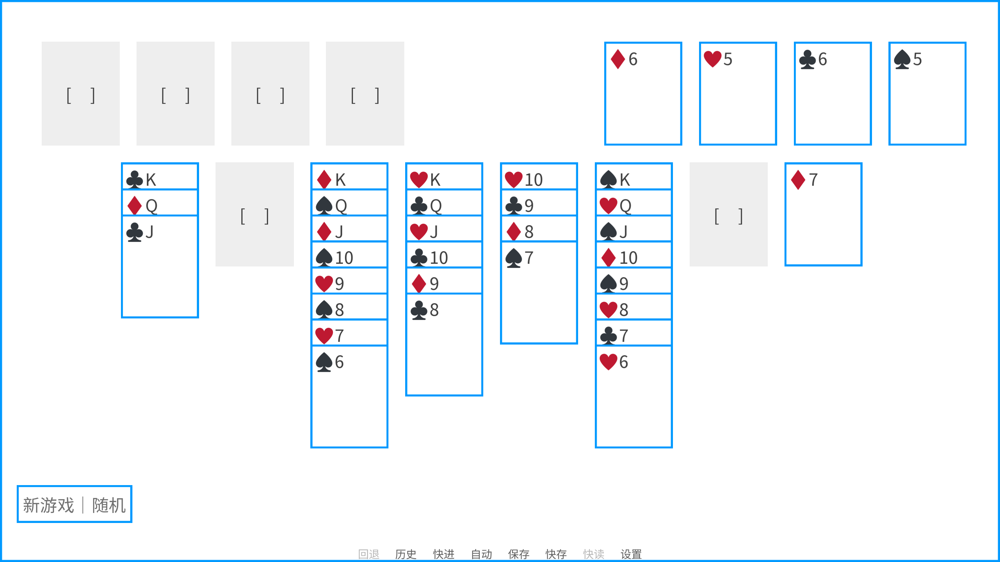

# 使用 Ren'Py 实现空当接龙游戏的尝试

## 数据结构

### Card

查看 `game/free_cell/card.rpy`

### Game

查看 `game/free_cell/game.rpy`

### 配置信息

查看 `game/free_cell/config.rpy`

## 引擎与交互

使用 `draggroup` 以及 `drag` 处理纸牌的拖拽和点击行为。

### 拖拽与点击

使用 `Drag.dragged(drags, drop)` 处理纸牌的拖拽事件，或者，使用 `Drag.dropped(drop, drags)` 处理纸牌的放置事件。

如果放置位置不合法，使用 `Drag.snap(x, y, delay)` 将纸牌归位。注意：如果有多张纸牌在拖动，也要一起归位。

使用 `Drag.draggable` 禁用不可拖动的纸牌。

使用 `Drag.drag_joined(drag) ->  [ (drag, x, y) ]` 连带其他纸牌一同移动，用于处理拖拽一叠纸牌的情况。

### 点击移动

点击一张牌时的处理顺序：

1. 单张牌（没有更多牌压在上面），优先考虑能否放进回收区；
2. 单张或者整叠牌，能否放在桌面区的某张牌下面（花色数字匹配；有足够的空位完成 supermove）；
3. 单张或者整叠牌，看能否放在桌面区的空位（检查是否有足够的空位进行 supermove）；
4. 单张牌，能不能放在中转区；

使用 `Drag.clicked(drag)` 处理纸牌的点击事件。

使用 `Drag.snap(x, y, delay)` 呈现纸牌的移动过程。

使用 `Drag.snapped(drag, x, y, completed)` 在纸牌移动结束后变更游戏数据。

### 移动动画

使用 `Drag.snap(x, y, delay)` 处理纸牌的移动，使用 `Drag.snapped(drag, x, y, completed)` 在纸牌移动结束后变更游戏数据。

## 文件管理

空当接龙相关的文件放在 `game/free_cell/` 中。

每个组件（界面），放在不同的文件中，以 `screen_` 开头，例如 `screen_card.rpy`. 组件用到的 python 函数定义，与组件放在同一文件中，位于文件开头。

游戏的主要组件（界面），全局的 game 状态，放在 `game/free_cell/screen.rpy`.

## 界面布局

查看 `game/free_cell/config.rpy`.

游戏画布 1920x1080, 留有一圈 `PADDING`.

纸牌的高度是 `CARD_HEIGHT`, 纸牌的宽度是 `CARD_WIDTH`. 纸牌还有个 `MINI_CARD_HEIGHT` 是（桌面区）堆叠情况下的（最大展示）高度，相当于下一张纸牌相对上一张纸牌的 y 偏移。

中转区只会有一张牌呈现，不会堆叠。

回收区的纸牌是完全覆盖的，不存在 Y 的偏移。

纸牌的列与列之间，中转区与桌面区，回收区与桌面区，的间距都是 `GAP`

中转区位于左上角。

回收区位于右上角。

桌面区紧靠中转区与回收区，居中。
